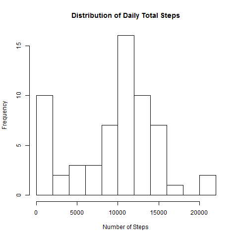
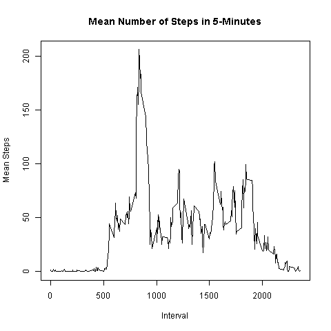
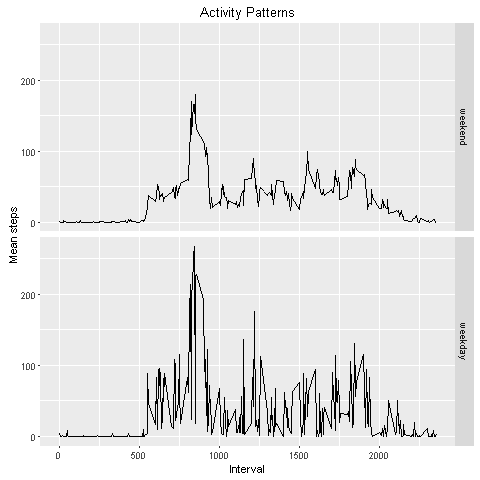

## Loading and preprocessing the data

```r
rm( list = ls() )
raw_file<-"activity.zip"
unzip(raw_file)
data <- read.csv('activity.csv', header=TRUE, na.strings="NA")
head(data)
```

```
##   steps       date interval
## 1    NA 2012-10-01        0
## 2    NA 2012-10-01        5
## 3    NA 2012-10-01       10
## 4    NA 2012-10-01       15
## 5    NA 2012-10-01       20
## 6    NA 2012-10-01       25
```

```r
str(data)
```

```
## 'data.frame':  17568 obs. of  3 variables:
##  $ steps   : int  NA NA NA NA NA NA NA NA NA NA ...
##  $ date    : Factor w/ 61 levels "2012-10-01","2012-10-02",..: 1 1 1 1 1 1 1 1 1 1 ...
##  $ interval: int  0 5 10 15 20 25 30 35 40 45 ...
```

```r
# check missing values 
summary(data$steps)
```

```
##    Min. 1st Qu.  Median    Mean 3rd Qu.    Max.    NA's 
##    0.00    0.00    0.00   37.38   12.00  806.00    2304
```

```r
summary(data$interval)
```

```
##    Min. 1st Qu.  Median    Mean 3rd Qu.    Max. 
##     0.0   588.8  1178.0  1178.0  1766.0  2355.0
```

```r
summary(data$date) 
```

```
## 2012-10-01 2012-10-02 2012-10-03 2012-10-04 2012-10-05 2012-10-06 
##        288        288        288        288        288        288 
## 2012-10-07 2012-10-08 2012-10-09 2012-10-10 2012-10-11 2012-10-12 
##        288        288        288        288        288        288 
## 2012-10-13 2012-10-14 2012-10-15 2012-10-16 2012-10-17 2012-10-18 
##        288        288        288        288        288        288 
## 2012-10-19 2012-10-20 2012-10-21 2012-10-22 2012-10-23 2012-10-24 
##        288        288        288        288        288        288 
## 2012-10-25 2012-10-26 2012-10-27 2012-10-28 2012-10-29 2012-10-30 
##        288        288        288        288        288        288 
## 2012-10-31 2012-11-01 2012-11-02 2012-11-03 2012-11-04 2012-11-05 
##        288        288        288        288        288        288 
## 2012-11-06 2012-11-07 2012-11-08 2012-11-09 2012-11-10 2012-11-11 
##        288        288        288        288        288        288 
## 2012-11-12 2012-11-13 2012-11-14 2012-11-15 2012-11-16 2012-11-17 
##        288        288        288        288        288        288 
## 2012-11-18 2012-11-19 2012-11-20 2012-11-21 2012-11-22 2012-11-23 
##        288        288        288        288        288        288 
## 2012-11-24 2012-11-25 2012-11-26 2012-11-27 2012-11-28 2012-11-29 
##        288        288        288        288        288        288 
## 2012-11-30 
##        288
```

## What is mean total number of steps taken per day?

### 2a. Calculate the total number of steps taken per day

```r
daySum <- aggregate( x=data$steps[!is.na(data$steps)], 
                     by=list(date=data$date[!is.na(data$steps)]), 
                     FUN=sum)
head(daySum)
```

```
##         date     x
## 1 2012-10-02   126
## 2 2012-10-03 11352
## 3 2012-10-04 12116
## 4 2012-10-05 13294
## 5 2012-10-06 15420
## 6 2012-10-07 11015
```

```r
str(daySum)
```

```
## 'data.frame':  53 obs. of  2 variables:
##  $ date: Factor w/ 61 levels "2012-10-01","2012-10-02",..: 2 3 4 5 6 7 9 10 11 12 ...
##  $ x   : int  126 11352 12116 13294 15420 11015 12811 9900 10304 17382 ...
```

### 2b. Make a histogram of the total number of steps taken each day

```r
# plot on screen
hist(daySum$x, main="Distribution of Daily Total Steps",
     xlab="Number of Steps", nclass=10)
```



```r
# save plot
png(file="Proj1_fig1.png", width=480, height=480)
hist(daySum$x, main="Distribution of Daily Total Steps",
     xlab="Number of Steps", nclass=10)
dev.off()
```

```
## RStudioGD 
##         2
```

```r
dev.cur()
```


```
## RStudioGD 
##         2
```

### 2c. Calculate and report the mean and median of the total number of steps taken per day

```r
summary(daySum$x) 
```

```
##    Min. 1st Qu.  Median    Mean 3rd Qu.    Max. 
##      41    8841   10760   10770   13290   21190
```

```r
dailyMeanSteps <- mean(daySum$x, rm.na=TRUE)
dailyMeanSteps
```

```
## [1] 10766.19
```

```r
dailyMedianSteps <- median(daySum$x)
dailyMedianSteps
```

```
## [1] 10765
```

#### Observation: Mean and median are slightly different from "summary" output. Why?


## What is the average daily activity pattern?

### 3a. Make a time series plot of the 5-minute interval (x-axis) and the average number of steps taken, averaged across all days (y-axis)

```r
summary(data$interval)
```

```
##    Min. 1st Qu.  Median    Mean 3rd Qu.    Max. 
##     0.0   588.8  1178.0  1178.0  1766.0  2355.0
```

```r
summary(data$steps)
```

```
##    Min. 1st Qu.  Median    Mean 3rd Qu.    Max.    NA's 
##    0.00    0.00    0.00   37.38   12.00  806.00    2304
```

```r
myMean <- aggregate( x=data$steps[!is.na(data$steps)], 
                     by=list(interval=data$interval[!is.na(data$steps)]), 
                     FUN=mean )
head(myMean)
```

```
##   interval         x
## 1        0 1.7169811
## 2        5 0.3396226
## 3       10 0.1320755
## 4       15 0.1509434
## 5       20 0.0754717
## 6       25 2.0943396
```

```r
str(myMean)
```

```
## 'data.frame':  288 obs. of  2 variables:
##  $ interval: int  0 5 10 15 20 25 30 35 40 45 ...
##  $ x       : num  1.717 0.3396 0.1321 0.1509 0.0755 ...
```

```r
summary(myMean$x)
```

```
##    Min. 1st Qu.  Median    Mean 3rd Qu.    Max. 
##   0.000   2.486  34.110  37.380  52.830 206.200
```

#### plot

```r
# plot on screen
plot(x=myMean$interval, y=myMean$x, type="l", 
     main="Mean Number of Steps in 5-Minutes", 
     xlab = "Interval", ylab="Mean Steps")
```



```r
# save plot
png(file="Proj1_fig2.png", width=480, height=480)
plot(x=myMean$interval, y=myMean$x, type="l", 
     main="Mean Number of Steps in 5-Minutes", 
     xlab = "Interval", ylab="Mean Steps")
dev.off()
```

```
## RStudioGD 
##         2
```

```r
dev.cur()
```


```
## RStudioGD 
##         2
```

### 3b. Which 5-minute interval, on average across all the days in the dataset, contains the maximum number of steps?

```r
myMax <- myMean$interval[myMean$x==max(myMean$x)]
myMax
```

```
## [1] 835
```

## Imputing missing values

### 4a. Calculate and report the total number of missing values in the dataset

```r
# check whether there are any dates missing (no)
length(unique(data$date)) == max(as.Date(data$date))-min(as.Date(data$date))+1
```

```
## [1] TRUE
```

```r
# check whether interval has missing values (no)
summary(data$interval)
```

```
##    Min. 1st Qu.  Median    Mean 3rd Qu.    Max. 
##     0.0   588.8  1178.0  1178.0  1766.0  2355.0
```

```r
# check whether all intervals are present (yes, there are 2304 NA values)
length(data$interval) == length(unique(data$date)) * 24 * 12
```

```
## [1] TRUE
```

```r
# Therefore, number of missing rows = number of missing values in data$steps

sum(is.na(data$steps))
```

```
## [1] 2304
```


### 4b. Devise a strategy for filling in all of the missing values in the dataset.
#### My strategy: replace missing values with mean for that day

### 4c. Create a new dataset that is equal to the original dataset but with the missing data filled in.

```r
dMean <- rep(daySum$x/(24*12), each=24*12)
data1 <- data
data1$steps[is.na(data$steps)] <- dMean[is.na(data$steps)]
summary(data1$steps)
```

```
##    Min. 1st Qu.  Median    Mean 3rd Qu.    Max.    NA's 
##    0.00    0.00    0.00   36.28   25.25  806.00     288
```

### 4d. Make a histogram of the total number of steps taken each day and calculate and report the mean and median total number of steps taken per day. Do these values differ from the estimates from the first part of the assignment? What is the impact of imputing missing data on the estimates of the total daily number of steps?

```r
daySum1 <- aggregate( x=data1$steps, 
                     by=list(date=data1$date), 
                     FUN=sum )
head(daySum1)
```

```
##         date     x
## 1 2012-10-01   126
## 2 2012-10-02   126
## 3 2012-10-03 11352
## 4 2012-10-04 12116
## 5 2012-10-05 13294
## 6 2012-10-06 15420
```

```r
str(daySum1)
```

```
## 'data.frame':  61 obs. of  2 variables:
##  $ date: Factor w/ 61 levels "2012-10-01","2012-10-02",..: 1 2 3 4 5 6 7 8 9 10 ...
##  $ x   : num  126 126 11352 12116 13294 ...
```

```r
summary(daySum1$x)
```

```
##    Min. 1st Qu.  Median    Mean 3rd Qu.    Max.    NA's 
##      41    8704   10590   10450   12990   21190       1
```

```r
# plot on screen
hist(daySum1$x, main="Distribution of Daily Total Steps\n(Missing Values Imputed)",
     xlab="Number of Steps", nclass=10)
```


```r
# save plot
png(file="Proj1_fig3.png", width=480, height=480)
hist(daySum1$x, main="Distribution of Daily Total Steps\n(Missing Values Imputed)",
     xlab="Number of Steps", nclass=10)
dev.off()
```

```
## RStudioGD 
##         2
```

```r
dev.cur()
```


```
## RStudioGD 
##         2
```


### It appears that imputation of missing values with mean steps of the day has no visible effect on the distribution, nor the mean and median. This is probably due to the nature of the missing values in the dataset, which likely occur only on certain days. Note that this result is strategy-dependent.                                                         


## Are there differences in activity patterns between weekdays and weekends?

### 5a. Create a new factor variable in the dataset with two levels - "weekday" and "weekend" indicating whether a given date is a weekday or weekend day.

```r
tf = is.element(weekdays(as.Date(data1$date)), c("Monday","Tuesday", 
                                            "Wednesday","Thursday","Friday") )
table(tf)
```

```
## tf
## FALSE  TRUE 
##  4608 12960
```

```r
str(tf)
```

```
##  logi [1:17568] TRUE TRUE TRUE TRUE TRUE TRUE ...
```

```r
F <- factor(tf)
levels(F)[levels(F)=="FALSE"] <- "weekend"
levels(F)[levels(F)=="TRUE"] <- "weekday"
str(F)
```

```
##  Factor w/ 2 levels "weekend","weekday": 2 2 2 2 2 2 2 2 2 2 ...
```

```r
head(F)
```

```
## [1] weekday weekday weekday weekday weekday weekday
## Levels: weekend weekday
```

```r
data1$F <- F
str(data1)
```

```
## 'data.frame':  17568 obs. of  4 variables:
##  $ steps   : num  0.438 0.438 0.438 0.438 0.438 ...
##  $ date    : Factor w/ 61 levels "2012-10-01","2012-10-02",..: 1 1 1 1 1 1 1 1 1 1 ...
##  $ interval: int  0 5 10 15 20 25 30 35 40 45 ...
##  $ F       : Factor w/ 2 levels "weekend","weekday": 2 2 2 2 2 2 2 2 2 2 ...
```

```r
head(data1)
```

```
##    steps       date interval       F
## 1 0.4375 2012-10-01        0 weekday
## 2 0.4375 2012-10-01        5 weekday
## 3 0.4375 2012-10-01       10 weekday
## 4 0.4375 2012-10-01       15 weekday
## 5 0.4375 2012-10-01       20 weekday
## 6 0.4375 2012-10-01       25 weekday
```

### 5b. Make a panel plot containing a time series plot (i.e. type = "l") of the 5-minute interval (x-axis) and the average number of steps taken, averaged across all weekday days or weekend days (y-axis).

```r
myMean2 <- aggregate( steps ~ interval + F, data=data1, mean, na.rm=TRUE )
str(myMean2)
```

```
## 'data.frame':  576 obs. of  3 variables:
##  $ interval: int  0 5 10 15 20 25 30 35 40 45 ...
##  $ F       : Factor w/ 2 levels "weekend","weekday": 1 1 1 1 1 1 1 1 1 1 ...
##  $ steps   : num  3.81 3.81 3.81 3.81 3.81 ...
```

```r
head(myMean2)
```

```
##   interval       F   steps
## 1        0 weekend 3.81033
## 2        5 weekend 3.81033
## 3       10 weekend 3.81033
## 4       15 weekend 3.81033
## 5       20 weekend 3.81033
## 6       25 weekend 7.06033
```

```r
tapply(myMean2$steps, myMean2$F, summary)
```

```
## $weekend
##    Min. 1st Qu.  Median    Mean 3rd Qu.    Max. 
##   3.810   4.779  31.840  41.500  69.940 156.900 
## 
## $weekday
##    Min. 1st Qu.  Median    Mean 3rd Qu.    Max. 
##   3.053   5.019  24.300  34.380  49.030 210.600
```

```r
# plot on screen
library(ggplot2)
ggplot(myMean2, aes(interval,steps))+geom_line()+facet_grid(F ~.)+
  labs(x="Interval")+labs(y="Mean steps")+
  labs(title="Activity Patterns")+
  facet_wrap(~F, ncol=1)
```



```r
# save plot
png(file="Proj1_fig4.png", width=480, height=480)
ggplot(myMean2, aes(interval,steps))+geom_line()+facet_grid(F ~.)+
  labs(x="Interval")+labs(y="Mean steps")+
  labs(title="Activity Patterns")+
  facet_wrap(~F, ncol=1)
dev.off()
```

```
## RStudioGD 
##         2
```

```r
dev.cur()
```


```
## RStudioGD 
##         2
```

### It appears that activity pattern for weekends is different from that for weekdays.
